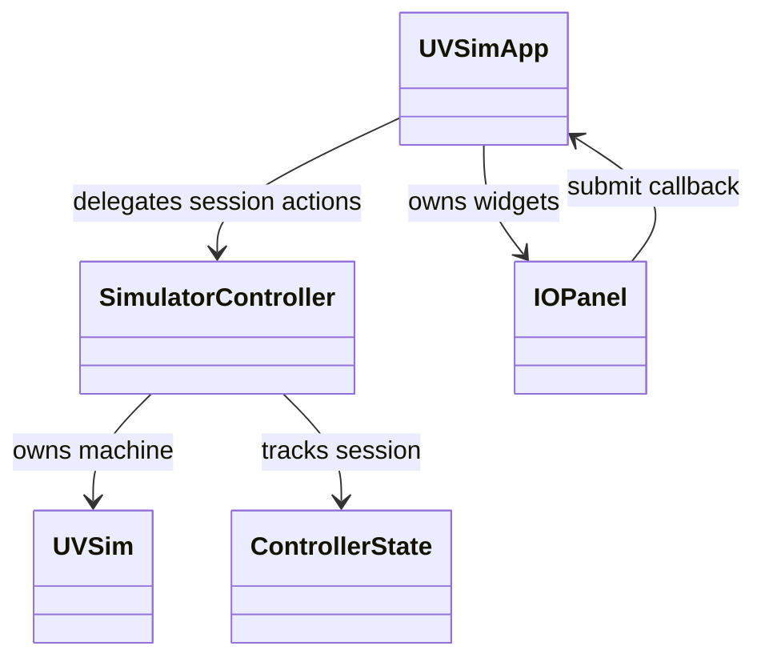

# Class definition document

UVSim Milestone 3 - October 2, 2026

## Architecture

The five application classes are described below. ControllerState extends Python's
Enum. No application interfaces, abstract classes, or other base classes are used.
The callback and injected panel/controller objects form structural contracts rather
than inheritance hierarchies. Tk widgets are composed inside GUI classes.

The controller uses loader.load_program and input_validation.parse_word. UVSim
uses operation-handler functions. GUI objects never execute opcodes or write
machine memory. The GUI invokes step(defer_io=True) indirectly through tick;
legacy terminal I/O remains in the default step mode for compatibility. This is
an architectural compromise: the machine has no Tk dependency, but still has a
legacy console adapter path that could be moved out in a future milestone.

All methods return None unless a return value is specified. Preconditions apply
to intended callers; guarded invalid-state actions are no-ops as documented.

## ControllerState (controller.py)

Purpose: enumerate EMPTY, READY, RUNNING, WAITING_INPUT, HALTED, STOPPED, ERROR.
Fields: inherited name and auto-generated value. No custom methods. Lowercase
names are exposed to the GUI; numeric enum values are not an external contract.

## SimulatorController (controller.py)

Purpose: coordinate loading, bounded execution, READ suspension, and output.
Fields: machine (owned UVSim), _state (ControllerState), _message (str),
_outputs (list[int]), _pending_read (address or None).

| Method/property | Purpose and inputs | Return | Preconditions | Postconditions |
| --- | --- | --- | --- | --- |
| __init__() | Create an empty session | New instance | None | Zeroed machine, empty output, no pending READ, empty state |
| load_file(path: str) | Validate file and replace session | bool accepted | Path string; no active run | Success resets machine/output/pending input and enters ready; failure preserves session and updates message; active loads rejected |
| start() | Start loaded program | None | Any state; only ready acts | ready becomes running; other states unchanged |
| tick(max_steps: int = 100) | Execute bounded batch | None | Nonnegative batch size; only running acts | At most max_steps; pauses at READ, halts, reports error, or remains running; WRITE appends numeric values |
| submit_input(text: str) | Validate and complete pending READ | bool accepted | Text string; waiting_input and pending address required | Invalid input preserves machine/pending request; valid input stores once, advances counter, clears request, enters running |
| stop() | Abandon active execution | None | Any state | running/waiting becomes stopped; pending input discarded; output retained; otherwise no-op |
| state | Read current state | str | Initialized | Lowercase enum name; no mutation |
| message | Read user-facing explanation | str | Initialized | No mutation |
| outputs | Read accumulated WRITE results | list[int] copy | Initialized | Caller cannot mutate internal output list |

State progression: empty -> ready -> running -> waiting_input -> running -> halted.
Running can end in error or stopped; waiting can end in stopped. Successful new
loading returns an inactive session to ready. Runtime errors retain existing output.

## UVSim (uvsim.py)

Purpose: represent 100 signed-word memory cells and execute BasicML instructions.
Fields: memory (100 ints), accumulator (int), instruction_counter (next address),
instruction_register (fetched word), halted (bool). Module constants specify
100 memory cells and word range -9999..9999.

| Method | Purpose and inputs | Return | Preconditions | Postconditions |
| --- | --- | --- | --- | --- |
| __init__() | Initialize machine | New instance | None | Memory/registers zero; halted false |
| load(words: list[int]) | Validate range/capacity, reset and load | None | Integer sequence | Valid list loads at 00, unused memory zero; registers reset; invalid capacity/range raises ValueError before mutation |
| step(*, defer_io: bool = False) | Fetch/decode/execute one instruction | None or (str, int) event | Initialized machine; valid counter/instruction unless already halted | Halted is no-op; deferred READ returns ('READ', address) without advancing; deferred WRITE returns ('WRITE', value) and advances; other operations update machine; HALT sets halted; ValueError/EOFError restores failing counter |
| run() | Legacy execution until HALT | None | Loaded runnable program, terminal I/O available if READ | Repeated default step calls until halted; propagates errors; may run indefinitely for looping programs; not used by GUI |

For READ, the controller completes the deferred instruction. For WRITE, it stores
the event's value. Arithmetic truncates overflow to four magnitude digits,
preserving sign; division truncates toward zero and rejects zero divisors.

## UVSimApp (gui/app.py)

Purpose: main window, file picker, controls, composition, and a single timer.
Fields: root, controller, panel; _timer (after callback ID or None), _closed,
_local_error, _filename; open_button/run_button/stop_button; filename/status
StringVars; file_label/status_label. The panel receives the submit_input callback.

| Method | Purpose and inputs | Return | Preconditions | Postconditions |
| --- | --- | --- | --- | --- |
| __init__(root, controller, panel_factory=IOPanel) | Compose live Tk root and controller contract | New instance | Working Tk root; panel factory accepts parent/callback | Widgets built/refreshed; close handler bound; one timer scheduled |
| _resize_labels(event) | Set text wrapping from event.width | None | Configure event while live | Filename/status wrap to available width |
| _schedule() | Schedule next 20 ms pump | None | Live root unless closed | At most one timer; no-op if closed/already scheduled |
| _pump() | Advance running controller and refresh | None | Timer callback, live app | Current timer cleared; bounded tick invoked unless local error; one next timer scheduled; closed app returns |
| _invoke(action, *args) | Call boundary action and capture expected failures | Action result or False | Callable and matching arguments | Clears previous local error; expected exception becomes visible local error and suppresses repeated ticks |
| open_file() | Show native file dialog | None | Inactive session | Cancel no-op; selected path delegated to load_file; picker failure becomes status error |
| load_file(path) | Delegate load and refresh controls | bool accepted | Path string | Active session rejected; filename changes only on successful load |
| start() | Delegate ready-state start | None | Live app | Controller starts only if ready; UI refreshed |
| stop() | Delegate running/waiting stop | None | Live app | Active execution stopped; UI refreshed |
| submit_input(text) | Delegate pending READ input | bool accepted | String; waiting_input required | Controller determines acceptance; UI refreshed before returning |
| refresh() | Reflect state, output, and status | None | Live widgets and controller | Run only ready; Stop active; Open inactive; panel refreshed; local error overrides controller message |
| close() | Cancel timer and destroy root | None | Any; idempotent | Closed flag set, timer cleared, root destroyed once |

Module function launch(path=None) creates a root/controller/app, optionally loads
a path, then enters mainloop. A retained NotImplementedError fallback displays an integration
notice if a component is replaced with an unfinished implementation; it is not
used by the completed application. Preconditions: available Tk display; postcondition:
returns after the window closes. It returns None.

## IOPanel (gui/io_panel.py)

Purpose: compose READ entry, submission control, and formatted WRITE display.
Fields: on_submit callback (str -> bool), _displayed_count, frame, output Text,
input_text StringVar, input_entry Entry, submit_button Button. A scrollbar is
connected to the output widget. It does not own machine state.

| Method | Purpose and inputs | Return | Preconditions | Postconditions |
| --- | --- | --- | --- | --- |
| __init__(parent, on_submit) | Build panel in supplied parent | New instance | Live Tk parent and acceptance callback | Empty read-only output; READ and Submit disabled; Enter bound |
| _submit(event=None) | Forward text via button/Enter callback | 'break' | Live widgets | Disabled input ignored; rejected text retained; accepted text cleared via StringVar even if callback disabled widget |
| refresh(state, outputs) | Render state string and sequence of ints | None | Same session output only appends; successful load first presents empty output | READ enabled only waiting_input; new output formatted/appended once; shorter sequence clears display; waiting entry receives focus |

## Supporting functions

loader.load_program(path) returns validated words or raises OSError/ValueError;
input_validation.parse_word(text) returns an in-range int or raises ValueError.
Operation modules provide stateless handlers acting on UVSim, plus format_word.
main.main() parses optional path and GUI/console flags; GUI is default. Its return
is 0 after normal completion or 1 after handled console errors. Argument parsing
may raise SystemExit. These modules define no additional application classes.

## Test-only classes

The unittest.TestCase subclasses in tests/ are validation fixtures, not runtime
architecture. setUp constructs isolated state; test_* methods take only self,
return None, and assert behavior or raise an assertion failure. Temporary files
and Tk roots are registered for cleanup. ControllerTests.load(name) loads a named fixture. The existing
arithmetic, flow, loader, validator, and regression classes exercise their named
modules; FeedbackTests.run_program(name, inputs) returns console output lines.

FakeController and FakePanel in test_gui_integration.py implement the same public
contracts for isolated window checks: load_file/start/stop/tick/submit_input and
outputs, or refresh(state, outputs), respectively. They record calls/state rather
than execute BasicML. TestGUIIntegration.make_app(controller=None) returns a
hidden app with those doubles and registers close cleanup. GUI fixtures skip only
when Tk cannot initialize; this must be reported separately from passing tests.
