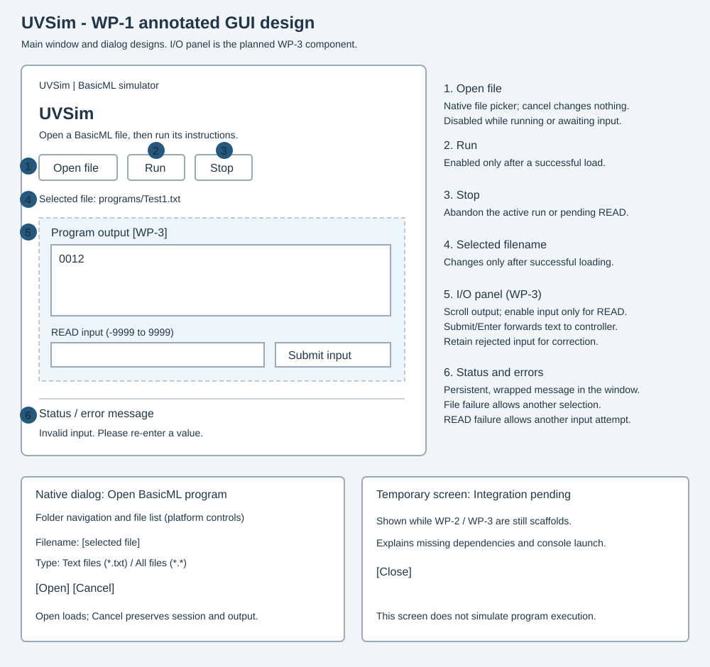

# GUI design and workflow

Updated October 2, 2026. The annotated wireframe represents the completed GUI.

The application has one main window and one native file-picker dialog. Status,
validation errors, and completion are shown in the main window, not separate
screens. The native dialog's visual styling varies by operating system.

1. **Open file:** browse any accessible folder. Open validates and loads; Cancel
   leaves the session untouched. Disabled during running or pending READ.
2. **Run:** enabled only after a valid load; execution uses bounded batches on
   one timer, keeping the window responsive.
3. **Stop:** abandons execution or a pending READ. Output remains; reload to run again.
4. **Filename:** last successfully loaded path. Failure preserves that filename.
5. **Program output:** read-only, vertical scrolling, four-digit magnitudes and
   separate negative signs. New output is appended once; successful loading clears it.
6. **READ input / Submit input / Enter:** enabled only while waiting for input.
   Invalid text remains editable. Accepted input clears and execution continues.
7. **Status/error area:** explains failure, waiting, running, Stop, and HALT.
   Retry file selection after load errors; correct text after READ errors.
8. **Resize and Close:** layout expands; closing cancels the timer and destroys the window.

## Component relationships

UVSimApp owns the window, one timer, a SimulatorController, and an IOPanel.
The controller owns UVSim and supplies state/message/output snapshots to the UI.
IOPanel forwards raw text through the window to the controller's validator.
Tkinter is confined to gui/. See ../class-definitions.md for method contracts.

## Verification

Permanent tests cover focused controller regressions and isolated window behavior.
Additional real-widget instructor checks were performed during final verification.
See ../verification.md and ../../tests/README.md. The GUI requires a working Tk
display; headless controller tests run without one.
